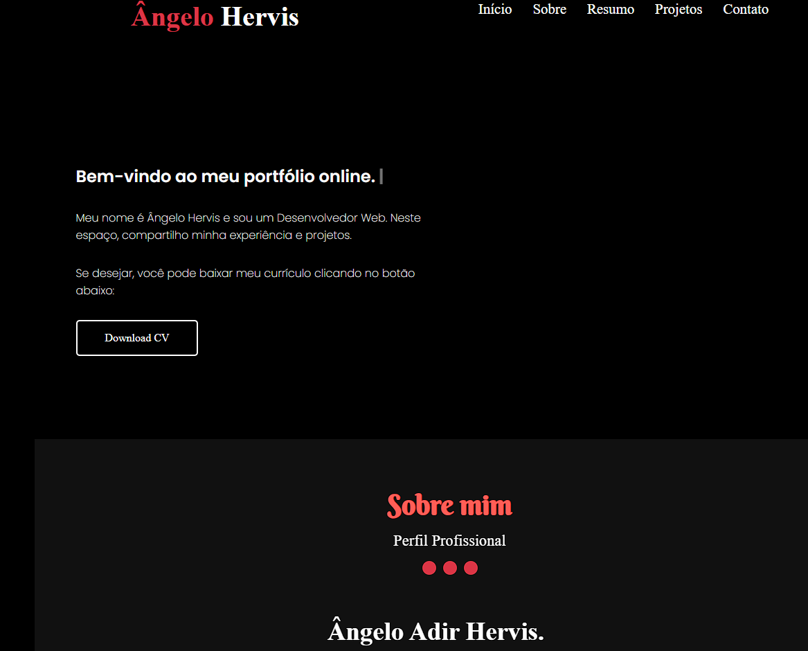

# Portfolio Angelo Hervis

## Descrição
Este é o repositório do meu portfólio pessoal, onde compartilho informações sobre mim, meus projetos e habilidades. Este projeto foi desenvolvido como parte do meu aprendizado em desenvolvimento web e também serve como uma forma de apresentação do meu trabalho e experiência para potenciais empregadores ou colaboradores.

## Conteúdo
- Sobre Mim: Breve introdução sobre quem eu sou e meus interesses.
- Projetos: Lista de projetos que desenvolvi, com links para os respectivos repositórios ou páginas de demonstração.
- Habilidades: Lista de habilidades técnicas e conhecimentos relevantes.
- Contato: Formulário de contato para envio de mensagens.

## Tecnologias Utilizadas
- HTML5
- CSS3 (com pré-processador SASS/SCSS)
- JavaScript
- Bootstrap (opcional, dependendo da preferência e necessidade de um framework CSS)
- Git (para controle de versão)

## Como Visualizar
1. Clone o repositório (`git clone https://github.com/AngeloHervis/portfolio-angelohervis.git`).
2. Abra o arquivo `index.html` em seu navegador web.

## Autor
Angelo Hervis
- GitHub: [AngeloHervis](https://github.com/AngeloHervis)
- LinkedIn: [Angelo Hervis](https://www.linkedin.com/in/angelohervis/)